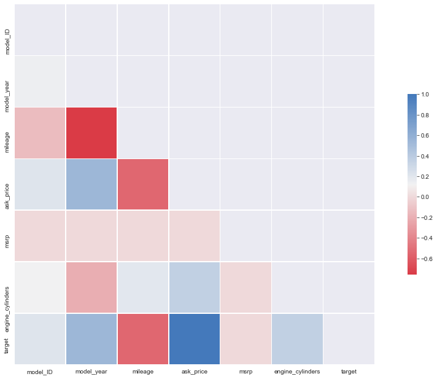

# ML-predictions
Alec H, Andrew P, Celena B, Dan T, Vilma D.

A full-stack, hosted application that predicts a vehicle's price.

# Intro

The purpose of this project was to develop a machine learning model with a real world application. For this we started with a dataset containing almost six million car entries scraped from the CIS auto website, developed a model on the cleaned data and used Flask and HMTL to allow users to interact with and recieve estimations of car value based on the Model Predictions.

# Data Set 

### COLUMNS

'body_class' - If the vehicle was a Sedan, Truck, or SUV.

'brand_name' - The manufacturer of the Vehicle

'model_name' - The Model of the Vehicle

'model_ID' - A unique ID for the Model

'model_year' - The year of Manufacture

'mileage' - Mileage at the time of Sale

'ask_price' - Price listed for sale

'msrp' - Manufacturer Suggested Retail Price

'color' - color

'engine_cylinders' - Number of cylinders

'fuel_type_primary' - Gas/Diesel

**====== Target ======**

'ask_price' - Price listed for sale

# Method

First step was to clean the information and in doing so we ended up with a sample of 400,000 entries across all three body classes.
Correlation matrices were made for the data as a whole and then for each Manufacturer. The data as a whole produced little correlation. It was after observing the weights assigned through the training of the model that we were able to see just how important some columns were to calculating the overall ask price of a vehicle.

Initially a model was trained using all data with an accuracy of 78%, however after noticing the change in correlation weight three models were produced, each trained on all of the data matching one of three bodyclasses. Each indidual model tested higher when allowed to train over data particular to it's own bodyclass.

Once the models were produced, a front end web page was set up to allow for data to be recieved from the user. Afterwards, a flask app was developed to load in the information that would be needed to evaluate the user data per model based on the user-input. 

#### Post-Processing:

A number of coumns were not considered in the training of the models due to their low correlation scores when evaluated at the beginning of the model training in addition, the top ten features of the models were evalutated after the initial training/testing. Those with too low of a correlation or weight were removed in future training to improve accuracy,
#### The following columns were removed:
- vin
- msrp
- color

## +++++++++++++++ Model +++++++++++++++

For this project we used a Random Forest Regression model for our data predictions.

### Advantages of the model:

Random Forest models make predictions based on the average of previously observed data, can handle large datasets without variable deletion, and generate an unbiased estimate of the generalization error as the forest building progresses, so a dataset of vehicles and prices was a fantastic fit for this model type.

### Limitaitons of the model:

Random Forest models have been observed to overfit noisy datasets, to avoid this we were strenuous in cleaning the training data which reduced the inital dataset by over 60%. This impacted the precision of the predictions for trucks, the model trained with the lowest amount of data and as such contains the highest possiblity for innacuracies, amongst the vehicle models with the lowest representation.

Each model achieved above a 78z% accuracy with a depth of 7 'trees' each having 100 estimators or 'branches'

### Changes to Improve the Model:

- Increasing n_estimators until either the time taken to train the model is unrealistic, or the model is prven to overfit the training data.

- Increase the amount of data in either 'pristine' condition (no NaN values across all features and no errors) or close enough to ensure an increase in accuracy without chance of bias towards certain features due to representation in the data.

- Consider which features best represent the worth of a car; adding an aggregation to stand for the average amount of maintenance in dollars($USD) per year, per model could provide an insight into the long term value of a vehicle when considering the cost of ownership over it's lifetime.

# Results:
### Sedan:
 

### Truck:
 

### SUV:
 

# Conclusion

This project combined many steps from developing an interface for the User to manipulate for data submission to training a Machine Learning Model to interpret the data and provide an accurate response. The main challenge, as with any kind of learning was that there's always more to learn and by extension - train. Having a data set that contains features that truly capture the value of a car will allow for the best predictions but not in all situations. Random Forest Models do not allow for extrapolation and 'thinking outside of the box', the model will return a prediction that best matches the average of the data fed during the training phase(s).
So to reach a full-fledge conclusion, more than one means of problem solving should be implemented, wiht the prediction being the starting point.

